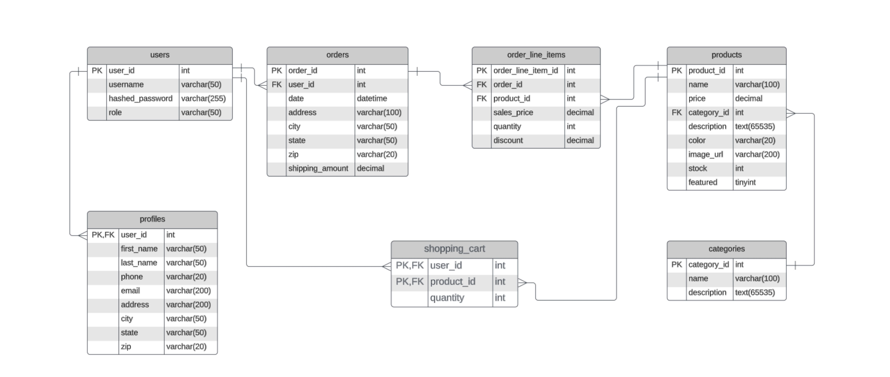

# EasyShop
A e-commerce application for a fictional company named EasyShop.

6-21-24
Looked at was needed to do to setup this up properly. I setup the tests I needed on postman, loaded up the database the application needed and changed the password in the application so it would run the database on my computer. I Wrote down what issues were problems still in the application and planned for what I would do the next time I would work on the project.

picture below is the database used for the application.

bugs and issue:
- Search Showing incorrect results
- products duplicated

6-23-24
 CategoriesDao and categoriesController are now functioning for the most part. The add function isn't working yet and there is duplicates showing up when pulling up all categories. Will hopefully be fixed by tomorrow.
 Pictures below are of the CategoriesDao and catergoriesController.

 
 

 bugs and issue:
 -Search Showing incorrect results
 -products duplicated

 6-24-24
 CategoriesDao and categoriesController are now working properly. Still working on fixing the bugs with the productDAO and productContorller. Found where one of the issues with it was ,but needing to figure out a soultion.

 bugs and issue:
 -Search Showing incorrect results
 -products duplicated

 6-25-24
 CategoriesDao,CategoriesController, productDao and productConorller are all working correctly now. Started working on the shopping cart. The interface has been fixed to have functions and the shoppingCartDao has the delete function finished along with the shoppingCartController. Will work on adding the other functions tommrow and hopefully have them up and running.
 Picture below is a pic of a productsController function that was causing issues before and was fixed today. 

 bugs and issues: N/A

 6-26-24
 Cart still dosen't work though the code is "done". Still needs more work ,but needs some adujstments still.

 bugs and issues: 
 -Cart not working still not running as intended.